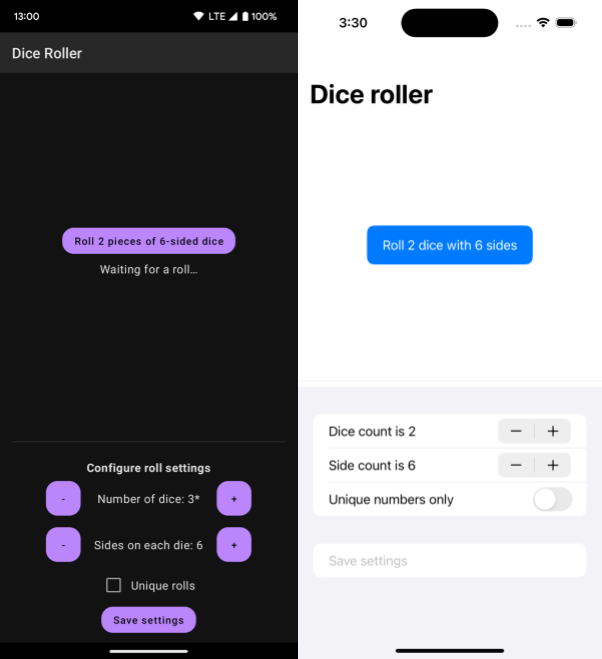

# DiceRoller

DiceRoller is a sample app using the Kotlin Multiplatform DataStore library to store and observe preferences.



## How it works

The app can roll a given number of dice with the given number of sides and display the results. You can also choose to roll numbers until each die produces a unique value.

You can change the settings for the rolls on the bottom half of the screen. Saving the settings writes them to DataStore, which the top of the screen then observes, using the new settings for subsequent rolls.

The `shared` module is the data layer implementation which includes the code accessing Preferences DataStore as well as the dice rolling logic. The `androidApp` and `iosApp` modules both depend on the `shared` module, and they contain an Android app with Jetpack Compose UI and an iOS app with SwiftUI, respectively.

## Running the app

### Android

1. Open the `DiceRoller` Gradle project in Android Studio
2. Run the app in the `androidApp` module

### iOS

The iOS application can only be built and run on macOS. You also need to have CocoaPods installed, which can generally be done by running `brew install cocoapods` or `sudo gem install cocoapods`.

See [CocoaPods Overview and Setup](https://kotlinlang.org/docs/native-cocoapods.html) and [Check your environment](https://kotlinlang.org/docs/multiplatform-mobile-setup.html#check-your-environment) for more details.

##### From Android Studio

1. Install the [Kotlin Multiplatform Mobile plugin](https://plugins.jetbrains.com/plugin/14936-kotlin-multiplatform-mobile)
2. Open the `DiceRoller` Gradle project in Android Studio
3. Choose the `iosApp` run configuration and run it

##### From Xcode

1. Run `./gradlew shared:podInstall` in the `DiceRoller` folder to initialize the project
   * You can skip this step if you've already opened the project in Android Studio and performed a Gradle sync
2. Open `iosApp.xcworkspace` (and NOT `iosApp.xcodeproj`!) in Xcode and start the active scheme

## License

```
Copyright 2022 The Android Open Source Project

Licensed under the Apache License, Version 2.0 (the "License");
you may not use this file except in compliance with the License.
You may obtain a copy of the License at

    https://www.apache.org/licenses/LICENSE-2.0

Unless required by applicable law or agreed to in writing, software
distributed under the License is distributed on an "AS IS" BASIS,
WITHOUT WARRANTIES OR CONDITIONS OF ANY KIND, either express or implied.
See the License for the specific language governing permissions and
limitations under the License.
```
